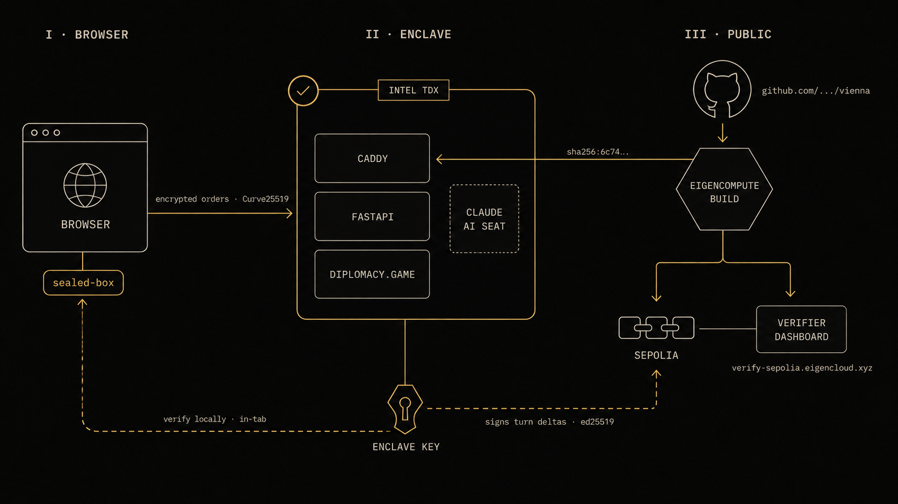

# Vienna

> _Verifiable Diplomacy on EigenCompute._
> Replace the GM, not the rules.

| | |
|---|---|
| **Live demo** | http://34.142.204.158:8080 |
| **Backend (TEE)** | http://34.142.204.158:8080 |
| **EigenCloud verifier** | https://verify-sepolia.eigencloud.xyz/app/0xec6B69887B4fd7280B81AB29a936b99516731F8E |
| **Source** | https://github.com/VictorChenCA/vienna |
| **Network** | Sepolia (EigenCompute private preview) |

Vienna is a multiplayer Diplomacy server that runs inside an Intel TDX
hardware enclave. Player orders are sealed in the browser so the operator
cannot read them, every turn's adjudication is signed by a key bound to the
running binary, and the running binary is cryptographically linked to this
public commit. AI seats — backed by Claude — keep games alive when humans
drop, with personality configs signed by the player who set them.

The frontend and the API live in the same enclave-bound FastAPI process —
serving the UI from a separate CDN would defeat the in-browser signature
verification that makes the whole trust chain work, so we don't. The
**Live demo** and **Backend (TEE)** rows above are intentionally the same
URL.

---

## The trust problem

Diplomacy is the only major board game whose **rules** require a trusted
third party. Seven players write secret orders, a GM holds and reveals
them simultaneously, then runs a complex deterministic adjudicator with
edge cases human GMs have historically gotten wrong (paradox resolution,
convoy disruption, support cuts). Without that adjudicator, the game
cannot be played at all.

Every online Diplomacy server today — webdiplomacy.net, Backstabbr,
PlayDiplomacy — solves this by asking you to trust the company hosting
it. Rebuild on AWS or Vercel and every trust property collapses:

- The operator can read everyone's secret orders.
- The operator can fudge adjudication and rewrite turn history.
- AI seats are opaque — no one can verify they ran the personality the
  player set.
- Post-game disputes have no resolution path.

Vienna moves the GM from "the company hosting the server" to **"Intel's
CPU attestation chain + a published commit you can read."**

---

## Architecture



The diagram has three zones, left to right.

**I · Browser.** Orders are written in a webdiplomacy-style click flow
(click unit → mode picker → click destination), sealed to the enclave's
Curve25519 envelope key using libsodium's sealed-box, and submitted over
HTTPS. Plain orders never leave the device. The same browser later
verifies every signed turn delta locally — no server round-trip required
to check trust. The dashed line returning to the browser at the bottom
of the diagram represents that in-tab verification path.

**II · Enclave.** The Intel TDX boundary holds a FastAPI surface, the
canonical `diplomacy/diplomacy` adjudicator (wrapped as a pip dependency,
not forked), and the in-enclave Ed25519 signing key. A Caddy front
terminates TLS. The optional dotted tile is a Claude AI seat — when one
is attached, it runs alongside the engine and signs each generated order
with the player-supplied persona fingerprint. The signing key is
generated in-enclave at first boot and never leaves; its public half is
bound to the binary's measurement via the TDX attestation quote (the wax
seal in the corner of the enclave).

**III · Public.** The image digest is reproducible from the GitHub commit
via EigenCompute's verifiable build sandbox. Build outputs land on
EigenLayer's Sepolia chain. The verifier dashboard hangs off the chain
node and surfaces the full provenance chain for anyone to inspect. The
gold trust-chain arrows show the two paths a skeptical user can take:
verify locally in their own browser tab, or verify on-chain through the
public dashboard. Neither path requires trusting the operator.

---

## How EigenCompute features map to Vienna

| Feature                   | Vienna implementation                                                                                                                                                                |
| ------------------------- | ------------------------------------------------------------------------------------------------------------------------------------------------------------------------------------ |
| **Source verifiability**  | Verifiable build from `github.com/VictorChenCA/vienna` produces a content-addressed image digest published in `/verify`. A reader can rebuild and compare.                           |
| **Attestations**          | Every `/games/:id/turns/:n` returns a turn delta Ed25519-signed by the enclave key. The pubkey is bound to the image measurement at `/attestation`.                                  |
| **Encrypted memory**      | Orders are sealed to a Curve25519 envelope key whose private half lives only inside the enclave. The plaintext is decrypted in attested TDX memory at the phase deadline.            |
| **Agent commerce**        | AI cabinet seats pay their own per-turn Claude inference from a USDC deposit, debited via the x402 / MPP `dual402` pattern. Out of budget = seat suspended.                          |
| **Programmatic payouts**  | Game-end winner attestation is signed by the enclave and consumed by an on-chain escrow contract on Sepolia. The contract recovers the pubkey, checks the image digest, releases.    |

---

## Verify it yourself

This is the rubric beat made into docs. You should be able to re-derive
Vienna's trust claim from scratch in five minutes.

### 1. Match the live binary to this commit

```bash
git clone https://github.com/VictorChenCA/vienna && cd vienna
git checkout $(curl -s http://34.142.204.158:8080/verify | jq -r .commit_sha)
docker build --build-arg GIT_COMMIT=$(git rev-parse HEAD) -t vienna:local .
```

Compare the resulting image digest to:

```bash
curl -s http://34.142.204.158:8080/verify | jq .image_digest
```

The same image digest is also published on the **EigenCloud verifier**
dashboard linked at the top of this README, alongside the on-chain
provenance signature.

### 2. Check a turn signature in the browser

Open the live URL. Create a game, hit **Demo seed**, hit **Resolve →**.
Click the timeline cell that appeared at the bottom. The
**Certificate of Adjudication** modal pops up with four numbered wax
stamps. The third and fourth (`Key` and `Signature`) are verified by
your browser, not by the server — that's the in-browser Ed25519 check
running on the signed delta the server returned.

### 3. Check from a clean terminal

```bash
node verify_cli/index.js http://34.142.204.158:8080/games/<your-game-id>/turns/1
```

Should print four green checks and exit 0. To see the kill moment: hit
the `⚠ Demo: simulate tamper` button in the certificate modal — Stamp II
flips red, the banner flips to "✗ Tampered · do not trust this turn,"
and the rebuilt CLI block in the modal shows the failure output.

---

## Inside the repo

```
vienna/
├── vienna/                    # the attested server (Python, FastAPI)
│   ├── server.py              # FastAPI surface; the entire API
│   ├── engine.py              # diplomacy.Game wrapper + signed TurnDelta
│   ├── crypto.py              # sealed-box decryption + Ed25519 signing
│   ├── ai_seat.py             # Claude-backed seats with x402 ledger
│   ├── payout.py              # game-end winner attestation
│   └── static/index.html      # single-file UI, vanilla JS, no build step
├── verify_cli/                # the local verifier
│   ├── index.js               # `node verify_cli/index.js <url>` (Node 18+)
│   └── package.json
├── tests/                     # 24 backend tests, all green
├── Dockerfile                 # python:3.11-slim + pinned deps
├── DEMO.md                    # 6-beat 3-min demo script
└── docs/
    └── architecture.png       # the diagram above
```

### Wrap, don't fork

Vienna depends on [`diplomacy`](https://pypi.org/project/diplomacy/) — the
reference DATC-compliant adjudicator Meta's CICERO research used — as a
pinned pip dependency. We do **not** modify the engine. The attestation
surface is the small FastAPI server you can audit in `vienna/server.py`.
Adjudication correctness is inherited verbatim.

---

## Built with

- **Backend** — Python 3.11, FastAPI, [`diplomacy/diplomacy`](https://github.com/diplomacy/diplomacy) 1.1.2, PyNaCl (sealed-box + Ed25519), Anthropic Python SDK
- **Frontend** — vanilla JS, single-file HTML, no build step, [`tweetnacl-js`](https://www.npmjs.com/package/tweetnacl) for in-browser sig verification
- **Engine** — Intel TDX via EigenCompute (`g1-standard-2s`)
- **TLS** — Caddy sidecar inside the same enclave
- **Deploy** — `ecloud compute app deploy --verifiable` against GitHub source
- **Verifier CLI** — Node 18+, zero build deps
- **Design system** — Newsreader italic display, Source Serif 4 body, Inter Tight UI, JetBrains Mono; warm-ink + parchment + gold palette

---

## Roadmap

Hit-list of things deferred for the Private Preview demo cut:

- **Real TDX quote in `/attestation`.** Server currently reads
  `VIENNA_TDX_QUOTE` from env; needs to read the host's quote sidecar
  (sysfs path / unix socket) and surface it directly.
- **Press / chat phase.** Diplomacy negotiation runs out-of-band today.
  Putting press inside the same encryption envelope is the natural v2.
- **Mainnet deployment.** Currently on Sepolia (wallet had no mainnet ETH
  for gas). The trust chain is identical on either chain; only the escrow
  contract address changes.
- **On-chain escrow contract.** Vienna produces signed winner attestations
  but the contract that consumes them is stubbed. ~50 lines of Solidity.
- **AI seat real Claude path.** `VIENNA_CLAUDE_LIVE=1` is wired but the
  Private Preview gateway 401 made me default to a deterministic stub.
  Re-enable once the gateway settles.
- **Custom domain + TLS.** Currently on raw IP:8080. The Caddy sidecar is
  already in the image — needs a domain pointing at the enclave IP and a
  TLS profile bump.

---

## Status

Built during the EigenCloud Private Preview, April – May 2026.
Not audited. Not for production funds.

The interesting bits — encrypted-orders + signed turns + in-browser
verification + the certificate UX — work end-to-end on the live URL
above.

## License

AGPL-3.0, inherited from upstream `diplomacy/diplomacy`. Network-accessible
deployments must publish their source under the same terms.

## Acknowledgements

- The `diplomacy/diplomacy` maintainers and the CICERO research team for
  the engine.
- The EigenCloud Private Preview team — especially Matt Murray and
  Mustafa — for the credits, the office hours, and the example repos.
- Wisdom and Megabyte from the preview cohort for the gateway-401
  debugging thread that saved me an hour.
- Built with [Claude](https://claude.ai/code).
